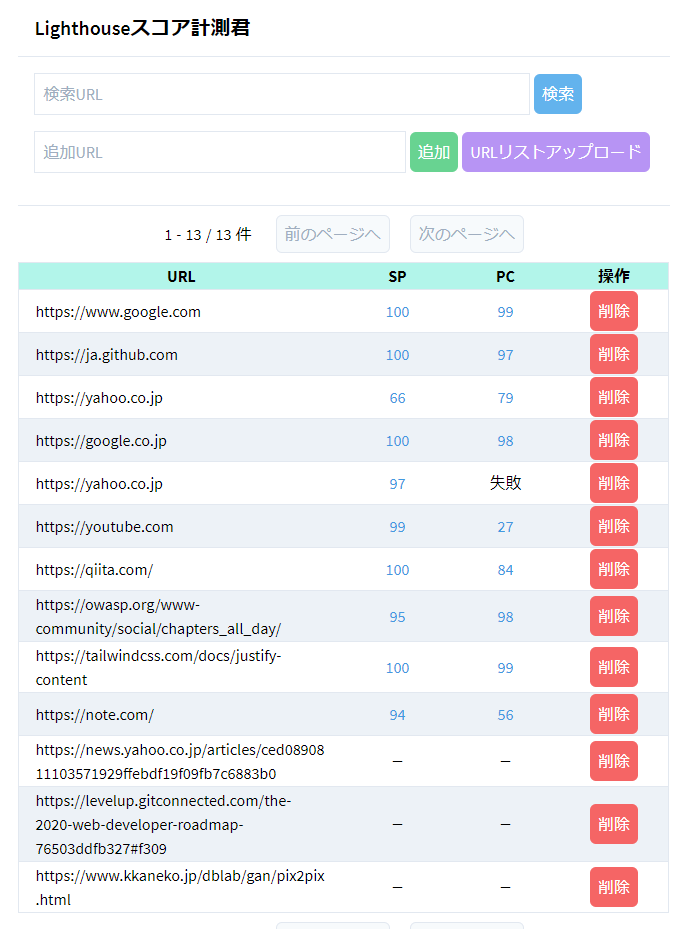

# Lighthouse Processor

## Environment

- OS:
    - Windows 10
    - Ubuntu 20.08
- Shell: bash
- Browser: Google Chrome
    - ※ Lighthouse の実行に必要なためインストール必須
- Node.js: 12.14.1
    - Yarn package manager: 1.21.1

***

## Architechure


- DB: MongoDB (NeDB)
    - REST API Server: http://localhost:8080
        - node-module: `express-nedb-rest`
        - [./db/](./db/)
- Frontend: http://localhost:3000
    - Nuxt.js
    - Tailwind.css
    - [./nuxt/](./nuxt/)
- Backend:
    - Node.js
        - lighthouse: Lighthouse計測CLI (要: Google Chrome)
        - node-schedule: プログラム定期実行 (毎分Lighthouse計測実行)
        - [./backend/](./backend/)

### Setup
```bash
# install node_modules in ./ , ./db/ , ./nuxt/
$ yarn setup

# => Windows だと失敗するかもしれない
## その場合は手動で以下のコマンドを実行
$ yarn install && yarn --cwd db install && yarn --cwd nuxt install && yarn --cwd backend install

# start servers
## nuxt dev server => http://localhost:3000
## nedb rest api server => http://localhost:8080
## backend cron scheduler => localhost
$ yarn start
```



### 動作確認
1. [動作確認用URLリスト.txt](./動作確認用URLリスト.txt) を「URLリストアップロード」からアップロード
2. 全てのURLが画面に反映されるか確認
    - 1ページ50件のページネーション
3. 毎分バックエンドでLighthouse計測処理が走るため、しばらく待って、各URLにスコアが記録されるか確認
4. 各スコアからLighthouse計測結果のレポートを確認

### Memo
Nuxt.js プロジェクト作成時のパラメータ

```bash
# create nuxt project => ./nuxt/
$ npx create-nuxt-app nuxt

# Project name: nuxt
# Programming language: JavaScript
# Package manager: Yarn
# UI framework: Tailwind CSS
# Nuxt.js modules: Axios
# Linting tools: ESLint
# Testing framework: None
# Rendering mode: Universal (SSR / SSG)
# Deployment target: Server (Node.js hosting)
# Development tools: jsconfig.json
```

***

## 既知の問題

- NeDB の IO が遅い
    - SQLite3, MySQL のような RDBS に変更するか、MongoDB に変更する
    - もしくは Firebase のような外部データベースシステムを利用する
- 現在の「URLリストアップロード」機能では大きなサイズのファイル（何万行レベルのURLリスト）をアップロードできない
    - tus プロトコルを使った分割アップロードに対応したい
    - もしくは、取り急ぎはURLリスト取り込み用のCLIを用意するだけで良いかも
- 検索機能で、計測失敗したデータ等の検索ができない
- WSL2 環境で Lighthouse 計測が実行できない
    - おそらく localhost IP の問題で Chrome ブラウザ実行 IP と上手く通信できていない
