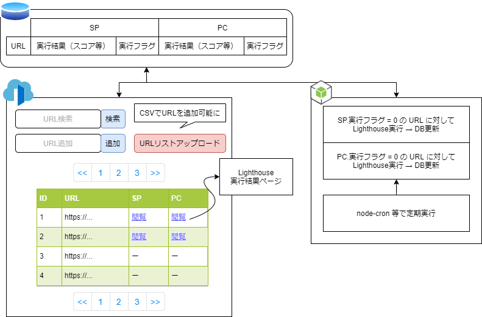

# Lighthouse CLI

## Environment

- Shell: bash
- Docker: 19.03.12
    - docker-compose: 1.26.0

***

## Architechure



- DB: MongoDB (NeDB)
    - REST API Server: http://localhost:8080
        - node-module: `express-nedb-rest`
        - [./db/](./db/)
- Frontend: http://localhost:3000
    - Nuxt.js
    - Tailwind.css
    - [./nuxt/](./nuxt/)
- Backend:
    - Node.js
        - lighthouse: Lighthouse計測CLI
        - node-cron: プログラム定期実行

### Setup
```bash
# install node_modules in ./ , ./db/ , ./nuxt/
$ yarn setup

# start servers
## nuxt dev server => http://localhost:3000
## nedb rest api server => http://localhost:8080
$ yarn start
```

### Memo
Nuxt.js プロジェクト作成時のパラメータ

```bash
# create nuxt project => ./nuxt/
$ npx create-nuxt-app nuxt

# Project name: nuxt
# Programming language: JavaScript
# Package manager: Yarn
# UI framework: Tailwind CSS
# Nuxt.js modules: Axios
# Linting tools: ESLint
# Testing framework: None
# Rendering mode: Universal (SSR / SSG)
# Deployment target: Server (Node.js hosting)
# Development tools: jsconfig.json
```
